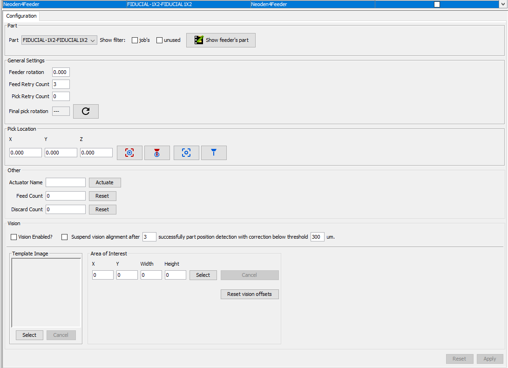

# Top vision suspension per feeder

For Neoden4Feeder was added option for suspend Top Vision component position correction.

If is turned on Vision correction is suspended after X (usually 3) successfully part position detection with mean correction below threshold (default 300um).
Vision correction is bring back if component from this feeder was discarded on bottom vision.
